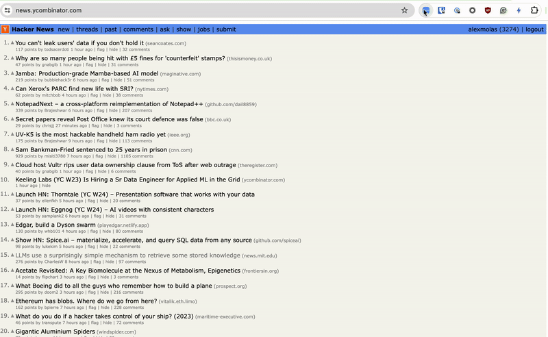

humble-hn
---

`humble-hn` is a Chrome extension that hides the number of votes and comments of stories, and the karma of users on Hacker News. The objective of this extension is to remove the influence of these numbers on the perception of the content.




# How to use the extension?

## Install extension from Chrome Store

You can install the extension directly from the Chrome Store using this [link to the extension](https://chromewebstore.google.com/detail/humble-hn/fgobiddccmfbgeikjllkolkpnbkciknd).

## Install it from source

To install the extension from source you only need to clone the repo

```
git clone git@github.com:alexmolas/humble-hn.git
```

Then, navigate to [chrome://extensions/](chrome://extensions/), toggle the `Developer mode` button, and click on `Load unpacked` button. Finally, upload the folder `humble-hn`  and that's all.

# How did I develop this?

I'm a data scientist with no knowledge of JavaScript or Web Development. I understand JavaScript code, but I can't write it from scratch and I don't know the best practices. To develop this extension I've used Cursor together with OpenAI API and Claude API. In total, I've paid less than 1 dollar (and it's probably to make it cheaper if you know a little bit of JavaScript, but I had to ask like a trillion clarifying questions). I want to be 100% transparent with that and I don't want to give the impression that I'm a JavaScript developer.

With these tools, it's been incredibly easy to develop this extension. However, I'm aware that the code maybe doesn't follow best practices, and I'm not sure how easy is to extend the current codebase to cover extra functionalities. I'm open to suggestions and contributions.

